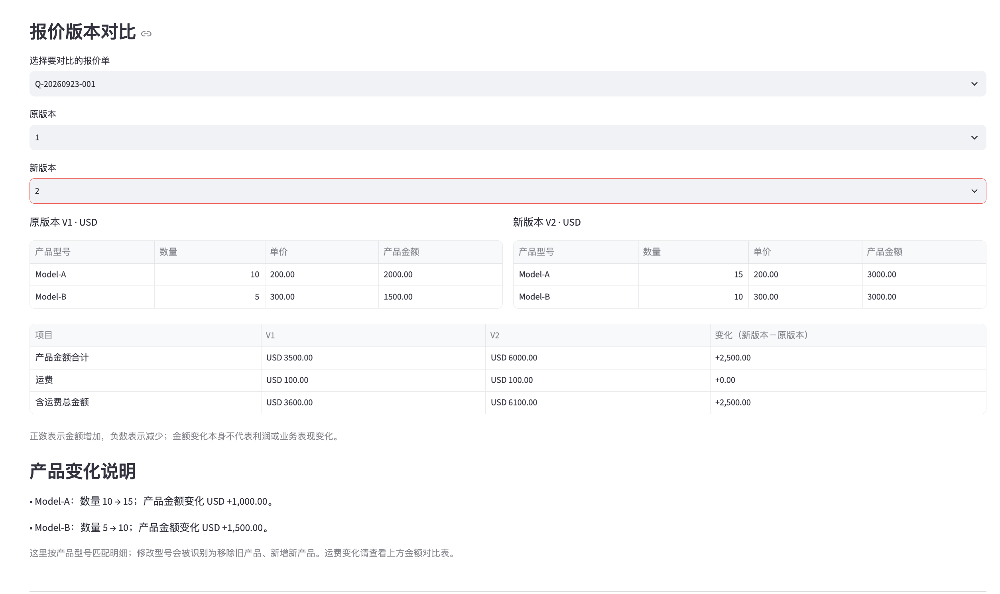
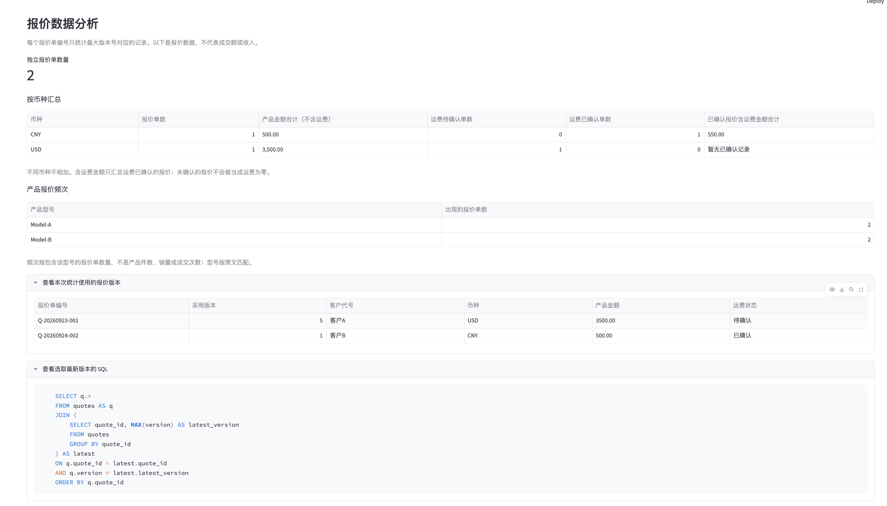

# 外贸智能报价与数据分析助手

一个基于 Python、Streamlit、SQLite 和 Gemini API 的个人项目，支持客户报价管理、历史版本对比、中英文报价说明生成与基础数据分析。

## 功能截图

### 报价版本对比

### 最新版本数据分析

## 项目背景

我曾在外贸工作中使用 Excel 整理客户报价。本项目以这一经历为起点，探索如何通过程序与 AI 辅助完成报价检查、修改留痕和客户沟通。

当前为使用模拟数据验证的本地原型，尚未投入企业生产使用。

## 已实现功能

- **报价检查与计算**：检查必要字段，计算产品金额与运费，区分“运费待确认”和“已确认零运费”。
- **Excel 导出与读取预览**：导出产品明细、报价汇总；读取本工具格式的 Excel 文件并预览。
- **历史报价管理**：使用 SQLite 保存记录，以“报价单编号＋版本号”防止重复覆盖。
- **版本修改与对比**：载入旧版本、另存新版本，展示产品数量、单价及金额变化。
- **AI 双语说明**：调用 Gemini API，根据已保存报价生成中英文沟通草稿，由用户核对后使用。
- **报价数据分析**：通过 SQL 提取每份报价的最新版本，使用 Python 统计独立报价数量、分币种金额与产品报价频次。

## 关键设计

### 程序负责计算，AI 负责表达

金额使用 Decimal 计算。AI 根据已确定的数据生成文字，不承担自主定价或交易决策，输出仍需人工核查。

### 未知运费不等于免费

运费未确认时，不计算含运费总金额。AI 草稿应明确说明待确认，不自行补充交期、付款条件或报价有效期。

### 多个版本不重复统计

同一编号可以保留多个报价版本，数据分析只采用最大版本号对应的记录。不同币种分别统计，报价金额不代表成交额或收入。

## 已进行的人工验证

使用少量模拟报价完成以下检查：

- 必填信息检查与金额计算。
- Excel 导出及格式读取预览。
- 保存报价、拦截重复版本、刷新后查询历史。
- 载入旧报价并保存新版本，确认旧记录不变。
- 数量和单价变化的版本对比。
- 运费已确认、运费待确认两类 AI 草稿核查。
- 最新版本去重、跨币种汇总和产品报价频次核查。

开发过程中遇到过缩进错误、历史数据未填回编辑区、API 密钥认证失败及免费额度限流，并进行了排查与处理。上述验证不代表全面测试或生产可靠性认证。

## 本地运行

建议使用 Python 3.13；本项目在 macOS、Python 3.13.2 环境下进行开发与验证。

1. 下载项目，在项目目录打开终端。
2. 创建并启用 Python 虚拟环境。
3. 执行 `python -m pip install -r requirements.txt` 安装依赖